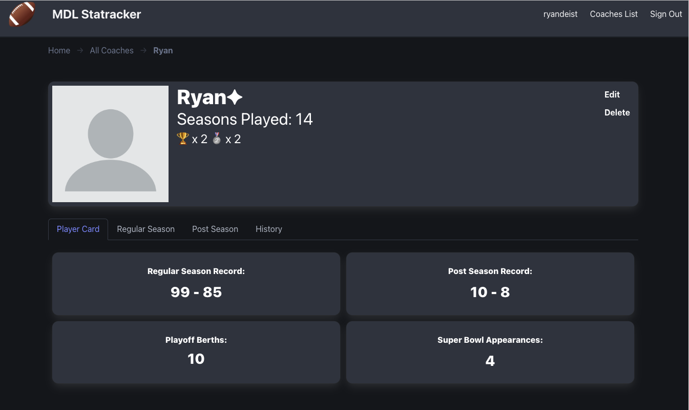

# MDL Statraker App

This application is a MEN Stack application that tracks all time coach data for players in a fantasy leage that I have been running for 14+ years. Building this application allow me to showcase my understanding of RESTful routes and CRUD in a real-world setting. It presented unique challenges with authenication and session validation, data visualization and manipulation, and styling. 

## Overview:
- This app has authorization built in, where a logged in user with Administrator privileges would be able to manipulate the data for each coach. 
- Error handling and user data validation is programmed into the authorization. Errors will be shown to the user if they enter the wrong login information, or attempt to create a duplicate account. 
- The home page of this app contains a link to an All Coaches index, which a table. This table does not yet have sort functionality. 
- With in the `/coaches` page, you can click into each individual coach to see a more detailed "Profile" displaying if they are active in the league and all time Regular, Post-Season, and Super Bowl data. 
- Guests and normal users can see all data, but only users with admin privledges can update the data. This is to protect the data from just anyone being able to edit it. 
- This app has CRUD functionality, with new coaches able to added on the `/coaches` route, and updates and deleting of coaches happening on the `coaches/:coachID` route.
- This app was designed to be mobile responsive with Bulma. 

[**Deployed App**](https://mdl-statracker-c011c52bd590.herokuapp.com/)

[**Original Planning Materials**](https://trello.com/b/6OqlySIp/project-2-fantasy-football-all-time-coach-data-app)

## Assets Attribution:
- [Football PNG](https://www.pngegg.com/en/png-tlaye#goog_rewarded)
- [Profile Pic Placeholder](https://pixabay.com/vectors/blank-profile-picture-mystery-man-973460/)

## Built with:

## Next Steps:
- Program sortable table
- Add embedded "Seasons" ERD to feed data to overall profile
- Add upload of pictures for non-admin users
- Live Data Tracking (connected to the Sleeper API)